See discussions, stats, and author profiles for this publication at: https://www.researchgate.net/publication/248336865

# Viscous-Inviscid Analysis of Transonic and Low Reynolds Number Airfoils

Article in AlAA Journal $\cdot$ October 1987

DOI: 10.2514/3.9789

CITATIONS

1,084

READS

4,769

2 authors, including:

Mark Drela

The American Institute of Aeronautics and Astronautics

142 PUBLICATIONS 7,669 CITATIONS

SEE PROFILE

# Viscous-Inviscid Analysis of Transonic and Low Reynolds Number Airfoils

Mark Drela* and Michael B. Giles†

Massachusetts Institute of Technology, Cambridge, Massachusetts

A method of accurately calculating transonic and low Reynolds number airfoil flows, implemented in the viscous-inviscid design/analysis code ISES, is presented. The Euler equations are discretized on a conservative streamline grid and are strongly coupled to a two-equation integral boundary-layer formulation, using the displacement thickness concept. A transition prediction formulation of the $e^9$ type is derived and incorporated into the viscous formulation. The entire discrete equation set, including the viscous and transition formulations, is solved as a fully coupled nonlinear system by a global Newton method. This is a rapid and reliable method for dealing with strong viscous-inviscid interactions, which invariably occur in transonic and low Reynolds number airfoil flows. The results presented demonstrate the ability of the ISES code to predict transitioning separation bubbles and their associated losses. The rapid airfoil performance degradation with decreasing Reynolds number is thus accurately predicted. Also presented is a transonic airfoil calculation involving shock-induced separation, showing the robustness of the global Newton solution procedure. Good agreement with experiment is obtained, further demonstrating the performance of the present integral boundary-layer formulation.

# Nomenclature

$C_D$ $= \mathrm{dissipation~coefficient}$ $(1 / \rho_{e}u_{e}^{3})\{\tau (\partial u / \partial \eta)\mathrm{d}\eta$   
$\bar{C_f}$ $= \mathrm{skin - friction~coefficient,}2\tau_{\mathrm{wall}} / \rho_e u_e^2$   
$\bar{C}_{\tau}$ =shear stress coefficient, $\tau_{\mathrm{max}} / \rho_e u_e^2$   
$h_0$ =stagnation enthalpy   
$\dot{H}$ = shape parameter, $\delta^{*} / \theta$   
$H^{*}$ $=$ kinetic energy shape parameter, $\theta^{*} / \theta$   
$II^{**}$ = density shape parameter, $\delta^{**} / \theta$   
$H_{k}$ $=$ kinematic shape parameter, $\int [1 - (u / u_e)]\mathrm{d}\eta$   
$\div \int (u / u_{e})[1 - (u / u_{e})]\mathrm{d}\eta$   
$M_{e}$ = boundary-layer edge Mach number   
$\tilde{n}$ = transition disturbance amplification variable   
$Re_{\theta} =$ momentum thickness Reynolds number, $\rho_{e}\mu_{e}\theta /\mu_{e}$   
$p$ = pressure   
$q$ =speed   
$u_{e}$ = boundary-layer edge velocity   
$u_{\tau}$ $=$ wall shear velocity, $\sqrt{\tau_{\mathrm{wall}} / \rho}$   
$\delta^{*}$ $=$ displacement thickness, $\int [1 - (\rho u / \rho_{e}u_{e})]\mathrm{d}\eta$   
$\delta^{**} =$ density thickness, $\int (u / u_{e})[1 - (\rho /\rho_{e})]\mathrm{d}\eta$   
$\xi ,\eta$ =thin shear layer coordinates   
$\theta$ $=$ momentum thickness, $\int (\rho u / \rho_{e}u_{e})[1 - (u / u_{e})]\mathrm{d}\eta$   
$\theta^{*}$ $= \mathrm{kinetic~energy~thickness},\int (\rho u / \rho_{e}u_{e})[1 - (u^{2} / u_{e}^{2})]\mathrm{d}\eta$   
$\mu_{e}$ = boundary-layer edge viscosity   
$\rho$ =density   
$\rho_{e}$ = boundary-layer edge density   
$\pmb{\tau}$ =shear stress

# I. Introduction

EFFECTIVE airfoil design procedures require a fast, robust analysis method for on-design and off-design performance evaluation. For a given time and cost schedule, a fast analysis method obviously permits more detailed optimization than a slower method of comparable accuracy and thus results in a better final design.

The various airfoil analysis and/or design algorithms that have been developed in the past decade have employed one of two distinct approaches: the full Reynolds-averaged Navier-Stokes approach and the interacted viscous-inviscid zonal approach.

As a rule, the Navier-Stokes approach is too slow for routine design work and has not yet shown any accuracy advantages over the much faster zonal approaches. Typical zonal approaches, such as the GBK code of Garabedian, Bauer, Korn, $^{1}$ and the GRUMFOIL code of Melnik, Chow, and Mead, $^{2}$ use a full-potential formulation for the inviscid flow and an integral boundary-layer formulation for the boundary-layer and wake regions. The viscous and inviscid flows are strongly coupled, usually through a wall transpiration boundary condition on the inviscid flow. The interacted zonal approaches are reasonably fast and accurate for transonic flows and are generally preferred for transonic airfoil analysis.

The applicability of any interacted viscous-inviscid analysis method to low Reynolds number flows (chord $Re < 1$ million) critically depends on the boundary layer and transition prediction formulations employed in the method. Accurate representation of both laminar and turbulent separated flow is a must since transitional separation bubbles and their losses must be accurately calculated if accurate drag predictions are to be obtained. The transition prediction algorithm must likewise be reliable since it affects the termination point of any transitional separation bubble and hence determines the bubble's size and associated losses.

Transitional bubble calculations have previously been reported by several workers. Gleyzes, Cousteix, and Bonnet employ an incompressible integral boundary-layer formulation with entrainment closure and couple this to some unspecified inviscid (presumably potential) solver for a model geometry. Vatsa and Carter employ a localized approach to calculate the transitional bubbles near an airfoil leading edge. The bubble solution is treated as a perturbation on a base solution obtained from the GRUMFOIL code.

The present airfoil analysis formulation, implemented in the transonic airfoil/ cascade analysis/design code ISES, $^{5-7}$ incorporates features aimed at computational economy, minimal user intervention, and good prediction accuracy for a wide range of Mach and Reynolds numbers. The steady Euler equa

tions in integral form are used to represent the inviscid flow, and a compressible lag-dissipation integral method is used to represent the boundary layers and wakes. The viscous and inviscid flows are fully coupled through the displacement thickness. The design capabilities of the ISES code were presented earlier in Drela6 and in Giles and Drela7 and are further demonstrated in the companion paper.8 The present paper is aimed at describing and demonstrating the viscous-inviscid analysis capability of the code, particularly for the difficult cases of transonic and low Reynolds number flows.

A novel feature of the ISES code, and one that makes it particularly suitable for very strongly interacting flows, is the solution technique used to solve the coupled viscous-inviscid equations. Instead of iterating between the viscous and inviscid solvers via some approximate interaction law, the entire nonlinear equation set is solved simultaneously as a fully coupled system by a global Newton-Raphson method. This is a very stable calculation procedure, even for such difficult cases as those with shock-induced separation.

The simultaneous coupling concept was first described in Drela, Giles, and Thompkins. Since that time, numerous changes have been made to the viscous formulation to improve its performance for transonic airfoil flows and to make the method applicable to low Reynolds number flows as well. Originally, the laminar boundary-layer portions were represented by Thwaites' method, and the turbulent portions were represented by Green's entrainment method. Neither formulation is valid for separated flow. Although Green's method has been extended to separated flows by Melnik and Brook, it is not possible to derive a valid Thwaites' method for separating flow since it is a one-equation method. Difficulties were also encountered in the transition formulation used at that time, due to the fundamentally different character of the Thwaites and Green formulations. All the above problems were resolved by switching to a two-equation dissipation-type closure for both the laminar and turbulent portions, with a lag equation added to the turbulent formulation. A free transition prediction method similar to that of Gleyzes, Cousteix, and Bonnet was formulated and incorporated into the global Newton solution scheme.

The calculations to be presented are entire airfoil drag polars at low Reynolds numbers for wide angle of attack ranges, and one transonic case with shock-induced separation. The polars, surface pressure distributions, and boundary-layer parameters are compared with experimental data.

# II. Inviscid Euler Formulation

The inviscid part of the flowfield is described by the steady-state mass, momentum, and energy conservation laws in integral form:

$$
\oint_ {\partial V} \rho (\boldsymbol {q} \cdot \boldsymbol {n}) \mathrm {d} l = 0 \tag {1}
$$

$$
\oint_ {\partial V} (\rho (\boldsymbol {q} \cdot \boldsymbol {n}) \boldsymbol {q} + p \boldsymbol {n}) \mathrm {d} l = 0 \tag {2}
$$

$$
\oint_ {\partial V} \rho (\boldsymbol {q} \cdot \boldsymbol {n}) h _ {0} \mathrm {d} l = 0 \tag {3}
$$

where the integration is around a closed curve $\partial V$ with normal $n$ .

These equations are discretized in conservation form on an intrinsic grid, in which one family of grid lines corresponds to streamlines. The discrete equations are presented in the companion paper. $^{8}$

# III. Boundary Conditions

The boundary conditions required to close the discrete Euler equations are very simple (see Fig. 1). At a solid surface, only the position of the adjacent streamline needs to be

specified. The surface pressure is a result of the calculation, and no pressure extrapolation to the wall is required. For a viscous case, the surface streamline is simply displaced normal to the wall by a distance equal to the local displacement thickness.

On the outermost streamlines of the domain, the pressure corresponding to a uniform freestream plus a compressible vortex, source, and doublet is specified. This far-field singularity expansion is derived in Drela. The strength of the far-field vortex is determined by the trailing-edge Kutta condition as in a potential solver. The source strength is determined from the far viscous and shock wakes. The two doublet components are determined by minimizing the deviation of the discrete streamlines from the direction of $\nabla \Phi$ , with $\Phi$ denoting the analytic velocity potential of the freestream, vortex, source, and doublet combination. The inclusion of the doublet in the far-field expansion greatly reduces the sensitivity of the solution to the distance of the outer domain boundary as shown in Giles and Drela.

At the inlet and outlet faces of the domain, the streamline angle corresponding to the flow angle of the freestream, vortex, source, and doublet combination is specified at each streamline position. The inlet plane also requires the stagnation density to be specified at each streamline.

# IV. Boundary-Layer Formulation

# Governing Equations

An important computational requirement that dictates the type of viscous formulation employed in the present design/ analysis method is the capability to represent accurately flows with limited separation regions. In order that transition be represented in a well-posed and analytically continuous man

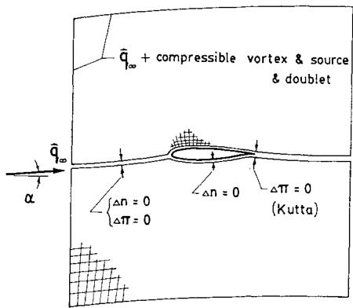  
Fig. 1 Isolated airfoil boundary conditions.

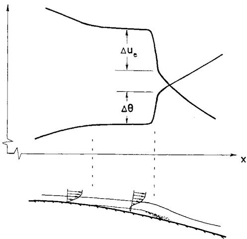  
Fig. 2 Jumps at bubble reattachment.

ner, compatibility between the laminar and turbulent formulations is required. And, of course, computational economy (meaning as few additional viscous variables as possible) is very important in the context of the global Newton solution procedure.

To meet the above requirements, a two-equation integral formulation based on dissipation closure was developed for both laminar and turbulent flows. A transition prediction formulation based on spatial amplification theory is incorporated into the laminar formulation, and an extra lag equation is included in the turbulent formulation to account for lags in the response of the turbulent stresses to changing flow conditions. Two-equation dissipation methods have been previously used by numerous workers, notably Le Balleur11 and Whitfield.12 A characteristic of two-equation methods is that, if properly formulated, they adequately describe thin separated regions. One-equation methods such as Thwaites' (given in Cebeci and Bradshaw)13 cannot be used to represent separated flows since they uniquely tie the shape parameter to the local pressure gradient which is, in fact, a nonunique relationship in separating flows.

The present formulation employs the following standard integral momentum and kinetic energy shape parameter equations.

$$
\frac {\mathrm {d} \theta}{\mathrm {d} \xi} + (2 + H - M _ {e} ^ {2}) \frac {\theta}{u _ {e}} \frac {\mathrm {d} u _ {e}}{\mathrm {d} \xi} = \frac {C _ {f}}{2} \tag {4}
$$

$$
\theta \frac {\mathrm {d} H ^ {*}}{\mathrm {d} \xi} + [ 2 H ^ {* *} + H ^ {*} (1 - H) ] \frac {\theta}{u _ {e}} \frac {\mathrm {d} u _ {e}}{\mathrm {d} \xi} = 2 C _ {D} - H ^ {*} \frac {C _ {f}}{2} \tag {5}
$$

Equation (5) is readily derived by combining the standard integral momentum equation (4) and the kinetic energy thickness equation (6) below.

$$
\frac {\mathrm {d} \theta^ {*}}{\mathrm {d} \xi} + \left(\frac {\delta^ {* *}}{\theta^ {*}} + 3 - M _ {e} ^ {2}\right) \frac {\theta^ {*}}{u _ {e}} \frac {\mathrm {d} u _ {e}}{\mathrm {d} \xi} = 2 C _ {D} \tag {6}
$$

# Closure

To close the integral boundary-layer equations (4) and (5), the following functional dependencies are assumed:

$$
H ^ {*} = H ^ {*} \left(H _ {k}, M _ {e}, R e _ {\theta}\right), \quad H ^ {* *} = H ^ {* *} \left(H _ {k}, M _ {e}\right) \tag {7}
$$

$$
C _ {f} = C _ {f} \left(H _ {k}, M _ {e}, R e _ {\theta}\right), \quad C _ {D} = C _ {D} \left(H _ {k}, M _ {e}, R e _ {\theta}\right) \tag {8}
$$

Here, $H_{k}$ is the kinematic shape parameter defined with the density taken constant across the boundary layer. In effect, the correlations in Eqs. (7) and (8) are defined in terms of the velocity profile shape only and not the density profile. The definition of $H_{k}$ used here is that derived by Whitfield14 for adiabatic flows in air:

$$
H _ {k} = \frac {H - 0 . 2 9 0 M _ {e} ^ {2}}{1 + 0 . 1 1 3 M _ {e} ^ {2}} \tag {9}
$$

# Laminar Closure

The relations (7) and (8) can be determined if some profile family is assumed. For laminar flow, the present formulation employs the Falkner-Skan one-parameter profile family to derive the following relationships:

$$
\begin{array}{l} H ^ {*} = 1. 5 1 5 + 0. 0 7 6 \frac {(4 - H _ {k}) ^ {2}}{H _ {k}}, \quad H _ {k} <   4 \\ = 1. 5 1 5 + 0. 0 4 0 \frac {\left(H _ {k} - 4\right) ^ {2}}{H _ {k}}, \quad H _ {k} > 4 \tag {10} \\ \end{array}
$$

$$
\begin{array}{l} R e _ {\theta} \frac {C _ {f}}{2} = - 0. 0 6 7 + 0. 0 1 9 7 7 \frac {(7 . 4 - H _ {k}) ^ {2}}{H _ {k} - 1}, \quad H _ {k} <   7. 4 \\ = - 0. 0 6 7 + 0. 0 2 2 \left(1 - \frac {1 . 4}{H _ {k} - 6}\right) ^ {2}, \quad H _ {k} > 7. 4 \tag {11} \\ \end{array}
$$

$$
\begin{array}{l} R e _ {\theta} \frac {2 C _ {D}}{H ^ {*}} = 0. 2 0 7 + 0. 0 0 2 0 5 (4 - H _ {k}) ^ {5. 5}, \quad H _ {k} <   4 \\ = 0. 2 0 7 - 0. 0 0 3 \frac {\left(H _ {k} - 4\right) ^ {2}}{\left(1 + 0 . 0 2 \left(H _ {k} - 4\right) ^ {2}\right)}, H _ {k} > 4 \tag {12} \\ \end{array}
$$

An expression for the density thickness shape parameter $H^{**}$ has been derived by Whitfield14 for turbulent flows. Here it is used for laminar flows as well. This is justified on the grounds that $H^{**}$ has a fairly small effect in transonic flows and is negligible at low subsonic speeds.

$$
H ^ {* *} = \left(\frac {0 . 0 6 4}{H _ {k} - 0 . 8} + 0. 2 5 1\right) M _ {e} ^ {2} \tag {13}
$$

# Turbulent Closure

The turbulent closure relations in the present formulation are derived using the skin-friction and velocity profile formulas of Swafford.[15]

$$
\begin{array}{l} F _ {c} C _ {f} = 0. 3 e ^ {- 1. 3 3 H _ {k}} \left[ \log_ {1 0} \left(\frac {R e _ {\theta}}{F _ {c}}\right) \right] ^ {- 1. 7 4 - 0. 3 1 H _ {k}} \\ + 0. 0 0 0 1 1 \left[ \tanh  \left(4 - \frac {H _ {k}}{0 . 8 7 5}\right) - 1 \right] \tag {14} \\ \end{array}
$$

where

$$
F _ {c} = \left(1 + 0. 2 M _ {e} ^ {2}\right) ^ {1 / 2} \tag {15}
$$

$$
\begin{array}{l} \frac {u}{u _ {e}} = \frac {u _ {\tau}}{u _ {e}} \frac {s}{0 . 0 9} \arctan (0. 0 9 y ^ {+}) \\ + \left(1 - \frac {u _ {\tau}}{u _ {e}} \frac {s \pi}{0 . 1 8}\right) \tanh  ^ {1 / 2} [ a (\eta / \theta) ^ {b} ] \tag {16} \\ \end{array}
$$

where

$$
\frac {u _ {\tau}}{u _ {e}} = \left| \frac {C _ {f}}{2} \right| ^ {1 / 2}, \quad s = \frac {C _ {f}}{| C _ {f} |}, \quad y ^ {+} = \frac {u _ {\tau}}{\mu_ {e} / \rho_ {e}} \eta \tag {17}
$$

Here, $a$ and $b$ are constants determined implicitly by substituting Eq. (16) into the standard momentum and displacement thickness definitions.

Using Eq. (16), the following relationship between $H^{*}$ , $H_{k}$ , and $Re_{\theta}$ has been derived:

$$
\begin{array}{l} H _ {k} = 1. 5 0 5 + \frac {4}{R e _ {\theta}} + \left(0. 1 6 5 - \frac {1 . 6}{R e _ {\theta} ^ {1 / 2}}\right) \frac {(H _ {0} - H _ {k}) ^ {1 . 6}}{H _ {k}}, \quad H _ {k} <   H _ {0} \\ = 1. 5 0 5 + \frac {4}{R e _ {\theta}} + \left(H _ {k} - H _ {0}\right) ^ {2} \left[ \frac {0 . 0 4}{H _ {k}} \right. \\ \left. + \frac {0 . 0 0 7 \log R e _ {\theta}}{\left(H _ {k} - H _ {0} + 4 / \log R e _ {\theta}\right) ^ {2}} \right], \quad H _ {k} > H _ {0} \tag {18} \\ \end{array}
$$

where

$$
\begin{array}{l} H _ {0} = 4, \quad R e _ {\theta} <   4 0 0 \\ = 3 + \frac {4 0 0}{R e _ {\theta}}, \quad R e _ {\theta} > 4 0 0 \tag {19} \\ \end{array}
$$

The dissipation coefficient $C_D$ is expressed as a sum of a wall layer and a wake layer contribution.

$$
C _ {D} = \frac {C _ {f}}{2} U _ {s} + C _ {\tau} \left(1 - U _ {s}\right) \tag {20}
$$

The shear coefficient $C_{\tau}$ is a measure of the shear stresses in the wake layer, and $U_{s}$ is an equivalent normalized wall slip velocity defined by the following relation:

$$
U _ {s} = \frac {H ^ {*}}{2} \left(1 - \frac {4}{3} \frac {H _ {k} - 1}{H}\right) \tag {21}
$$

Each of the two terms in the $C_D$ definition (20) consists of a stress and a velocity scale. The skin-friction coefficient $C_f$ depends only on the local boundary layer parameters. This is consistent with the notion of a universal wall layer known to respond rapidly to the local boundary-layer conditions. The shear stress coefficient $C_{\tau}$ , however, should not depend only on the local conditions since the Reynolds stresses in the wake layer are known to respond relatively slowly to changing conditions, especially in low Reynolds number flows. Following Green et al.,[16] this slow response is modeled by the following rate equation for $C_{\tau}$ , which is actually a simplified form of the stress-transport equation of Bradshaw and Ferriss.[17]

$$
\frac {\delta}{C _ {\tau}} \frac {\mathrm {d} C _ {\tau}}{\mathrm {d} \xi} = 4. 2 \left(C _ {\tau_ {\mathrm {E Q}}} ^ {1 / 2} - C _ {\tau} ^ {1 / 2}\right) \tag {22}
$$

The nominal boundary-layer thicknesses $\delta$ and the equilibrium shear stress coefficient $C_{\tau_{\mathrm{EQ}}}$ are defined by the following relations.

$$
\delta = \theta \left(3. 1 5 + \frac {1 . 7 2}{H _ {k} - 1}\right) + \delta^ {*} \tag {23}
$$

$$
C _ {\tau_ {\mathrm {E Q}}} = H ^ {*} \frac {0 . 0 1 5}{1 - U _ {s}} \frac {\left(H _ {k} - 1\right) ^ {3}}{H _ {k} ^ {2} H} \tag {24}
$$

The dissipation coefficient formula (20), the slip velocity definition (21), and the equilibrium shear stress definition (24) are derived from the well-known $G - \beta$ locus of equilibrium boundary layers postulated by Clauser. The empirical $G - \beta$ locus used in the present formulation is

$$
G = 6. 7 \sqrt {1 + 0 . 7 5 \beta} \tag {25}
$$

where

$$
G \equiv \frac {H _ {k} - 1}{H _ {k}} \frac {1}{\sqrt {C _ {f} / 2}}, \quad \beta \equiv - \frac {2}{C _ {f}} \frac {\delta^ {*}}{u _ {e}} \frac {\mathrm {d} u _ {e}}{\mathrm {d} \xi} \tag {26}
$$

The deviation of the turbulent boundary layer or wake from the equilibrium locus (25) is governed by the rate equation (22), which comes into play mainly in rapidly changing flows. In slowly changing flows, $C_{\tau}$ closely follows $C_{\tau \mathrm{EQ}}$ , and the empirical closure relations revert to their equilibrium form.

The governing integral equations (4) and (5) and all the turbulent closure relations are valid for free wakes, provided the skin-friction coefficient $C_f$ is set to zero. Hence, in the present formulation, a turbulent wake is naturally treated as two boundary layers with no wall shear. Laminar wakes do not occur in aerodynamic flows of interest and are not considered here.

# Transition

Accurate transition prediction is crucial in the analysis of low Reynolds number airfoils. In particular, the location of transition in a separation bubble strongly determines the

bubble's size and its associated losses. A typical separation bubble has very steep gradients in the edge velocity $u_{e}$ and momentum thickness $\theta$ at reattachment resulting in jumps $\Delta u_{e}$ and $\Delta \theta$ over the small extent of the reattachment region as indicated in Fig. 2. An equation that relates the jumps is readily obtained by integrating the integral momentum equation (4) over this small streamwise distance $\Delta \xi$ , neglecting the skin friction $C_{f}$ in the process.

$$
\frac {\Delta \theta}{\theta} \simeq - (2 + H - M _ {e} ^ {2}) \frac {\Delta u _ {e}}{u _ {e}} \tag {27}
$$

This relation clearly shows that a large initial shape parameter $H$ at reattachment induces a large relative jump in the momentum thickness. Since $H$ increases rapidly downstream in the laminar part of a separation bubble, it is clear from relation (27) that the momentum thickness jump will be sensitive to the bubble length and hence to the precise location of transition in the bubble. Because airfoil drag is directly affected by any momentum thickness jump, a precise and reliable method of transition prediction is mandatory for quantitative drag predictions of low Reynolds number airfoils with separation bubbles.

The present method employs a spatial-amplification theory based on the Orr-Sommerfeld equation, which is essentially the $e^9$ method pioneered by Smith and Gamberoni[19] and Ingen.[20] The $e^9$ method assumes that transition occurs when the most unstable Tollmien-Schlichting wave in the boundary layer has grown by some factor, usually taken to be $e^9 \simeq 8100$ . To calculate this amplification factor, the disturbance growth rates must be related to the local boundary-layer parameters. Using the Falkner-Skan profile family, the Orr-Sommerfeld equation has been solved for the spatial amplification rates of a range of shape parameters and unstable frequencies. As done by Gleyzes et al.,[3] the envelopes of the integrated rates are approximated by straight lines as follows:

$$
\tilde {n} = \frac {\mathrm {d} \tilde {n}}{\mathrm {d} R e _ {\theta}} \left(H _ {k}\right) \left[ R e _ {\theta} - R e _ {\theta_ {0}} \left(H _ {k}\right) \right] \tag {28}
$$

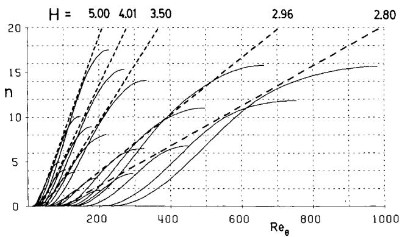

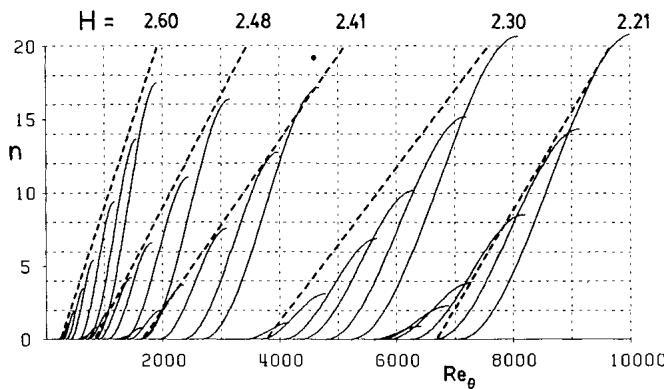  
Fig. 3 Orr-Sommerfeld spatial amplification curves.

Here, $\tilde{n}$ is the logarithm of the maximum amplification ratio. The slope $\mathrm{d}\tilde{n} / \mathrm{d}Re_{\theta}$ and the critical Reynolds number $Re_{\theta_0}$ are expressed by the following empirical formulas:

$$
\frac {\mathrm {d} \tilde {n}}{\mathrm {d} R e _ {\theta}} = 0. 0 1 \left\{\left[ 2. 4 H _ {k} - 3. 7 + 2. 5 \tanh  \left(1. 5 H _ {k} - 4. 6 5\right) \right] ^ {2} + 0. 2 5 \right\} ^ {1 / 2} \tag {29}
$$

$$
\begin{array}{l} \log_ {1 0} R e _ {\theta_ {0}} = \left(\frac {1 . 4 1 5}{H _ {k} - 1} - 0. 4 8 9\right) \tanh  \left(\frac {2 0}{H _ {k} - 1} - 1 2. 9\right) \\ + \frac {3 . 2 9 5}{H _ {k} - 1} + 0. 4 4 \tag {30} \\ \end{array}
$$

Figure 3 shows the envelopes defined by the above equations together with the actual amplification curves.

For similar flows, $H_{k}$ is a constant, and $Re_{\theta}$ is uniquely related to the streamwise coordinate $\xi$ . Hence, Eq. (28) immediately gives the amplitude ratio $\tilde{n}$ as a function of $\xi$ . Transition is assumed to occur where $\tilde{n} = 9$ . For nonsimilar flows, the amplitude ratio is calculated by integrating the local amplification rate downstream from the point of instability. Gleyzes et al. integrate the rate given by Eq. (29) with respect to $Re_{\theta}$ as follows:

$$
\tilde {n} = \int_ {R e _ {\theta_ {0}}} ^ {R e _ {\theta}} \frac {\mathrm {d} \tilde {n}}{\mathrm {d} R e _ {\theta}} \mathrm {d} R e _ {\theta} \tag {31}
$$

It turns out that Eq. (31) is not suitable for determining transition in separation bubbles since $Re_{\theta}$ hardly changes at all in the laminar portion of a typical bubble. Hence, Eq. (31) implies that very little amplification will occur in the separation bubble, which is clearly wrong. A more realistic approach is to integrate the amplification rate in the spatial coordinate $\xi$ . Using some basic properties of the Falkner-Skan profile family, the spatial amplification rate with respect to $\xi$ is determined as follows:

$$
\frac {\mathrm {d} \tilde {n}}{\mathrm {d} \xi} = \frac {\mathrm {d} \tilde {n}}{\mathrm {d} R e _ {\theta}} \frac {\mathrm {d} R e _ {\theta}}{\mathrm {d} \xi} = \frac {\mathrm {d} \tilde {n}}{\mathrm {d} R e _ {\theta}} \frac {1}{2} \left(\frac {\xi}{u _ {e}} \frac {\mathrm {d} u _ {e}}{\mathrm {d} \xi} + 1\right) \frac {\rho_ {e} u _ {e} \theta^ {2}}{\mu_ {e} \xi} \frac {1}{\theta} \tag {32}
$$

Using the empirical relations

$$
\frac {\rho_ {e} u _ {e} \theta^ {2}}{\mu_ {e} \xi} \equiv \ell \left(H _ {k}\right) = \frac {6 . 5 4 H _ {k} - 1 4 . 0 7}{H _ {k} ^ {2}} \tag {33}
$$

$$
\frac {\xi}{u _ {e}} \frac {\mathrm {d} u _ {e}}{\mathrm {d} \xi} \equiv m \left(H _ {k}\right) = \left(0. 0 5 8 \frac {\left(H _ {k} - 4\right) ^ {2}}{H _ {k} - 1} - 0. 0 6 8\right) \frac {1}{\ell \left(H _ {k}\right)} \tag {34}
$$

the amplification rate with respect to $\xi$ is expressed as a function of $H_{k}$ and $\theta$ :

$$
\frac {\mathrm {d} \bar {n}}{\mathrm {d} \xi} \left(H _ {k}, \theta\right) = \frac {\mathrm {d} \tilde {n}}{\mathrm {d} R e _ {\theta}} \left(H _ {k}\right) \frac {m \left(H _ {k}\right) + 1}{2} \ell \left(H _ {k}\right) \frac {1}{\theta} \tag {35}
$$

An explicit expression for $\tilde{n}$ then becomes

$$
\tilde {n} (\xi) = \int_ {\xi_ {0}} ^ {\xi} \frac {\mathrm {d} \tilde {n}}{\mathrm {d} \xi} \mathrm {d} \xi \tag {36}
$$

where $\xi_0$ is the point where $Re_{\theta} = Re_{\theta_0}$ .

In the present formulation, Eq. (36) is not used directly. Instead, the differential form (35) is discretized and solved as part of the global Newton system. Thus, $\tilde{n}$ is treated like another boundary-layer variable. This type of treatment is essential for a stable and rapid calculation procedure since the amplification equation (35) is very strongly coupled to

the integral boundary-layer equations (4) and (5) in a separation bubble.

# Boundary-Layer Equation Discretization

Figure 4 shows the primary turbulent boundary-layer variables $\theta$ , $\delta^{*}$ , $C_{r}^{\frac{1}{2}}$ in relation to the inviscid grid, with subscripts 1 and 2 denoting the $i-1$ th and $i$ th streamwise stations. All other boundary-layer variables can be expressed in terms of these primary variables. If the boundary layer is laminar between stations $i-1$ and $i$ , then the amplification ratio $\bar{n}$ replaces the shear stress coefficient $C_{r}^{\frac{1}{2}}$ as the primary variable. In the case of the transition interval, where transition onset occurs between stations $i-1$ and $i$ , $\tilde{n}_{1}$ and $C_{r_2}^{\frac{1}{2}}$ are the respective primary variables.

There are three different equations to be discretized: the momentum equation (4), the shape parameter equation (5), and either the amplification equation (35) or the lag equation (22). Two-point central differencing (i.e., the trapezoidal rule) is generally used. An exception to this is the shape parameter equation (5), which tends to be stiff because of the small quantity $\theta$ multiplying the spatial rate $\mathrm{d}H^{*} / \mathrm{d}\xi$ . At transition, this leads to numerical difficulties at higher Reynolds numbers since the resulting rapid analytic change in $H^{*}$ cannot be resolved by the available streamwise grid spacing. This problem is eliminated by biasing the differencing of the shape parameter equation toward the downstream station at higher Reynolds numbers. When the bias is entirely on the downstream station, the differencing is equivalent to backward Euler.

Special treatment is necessary in differencing across the transition interval. For a stable and reliable solution procedure, it is essential that no discontinuities in the solution are admitted as the transition point moves across a grid point. In the present formulation, the transition interval is treated as two subintervals as shown in Fig. 5.

By applying the discrete amplification equation to the laminar subinterval, the transition onset location $\xi_{tr}$ can be implicitly defined in terms of the neighboring primary variables. The boundary-layer variables at $\xi_{tr}$ can thus be interpolated from the $i$ th and $i-1$ th stations. The actual discrete equations governing the transition interval are weighted averages of the laminar and turbulent subintervals. Although this formulation precisely defines the transition onset location in a continuous manner, it is still necessary to define how the turbulence develops afterward. To date, no useful empirical laws describing transitional Reynolds stresses have been formulated and most likely won't be formulated for some time, given the complexity of the problem. The approach adopted here is to set the initial value of $C_{\tau}^{y/2}$ at $\xi_{tr}$ to 0.7 times its equilibrium value, as indicated in Fig. 5. The key to the success of such a simple model is that the momentum integral equation (4), which governs the all

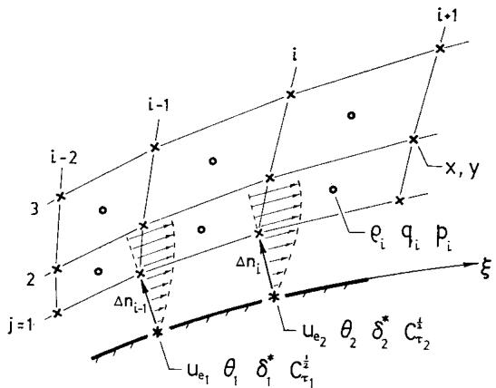  
Fig. 4 Boundary-layer variable locations.

important momentum thickness jump at reattachment, remains essentially correct, irrespective of the precise reattachment mechanism. In any case, the transition formulation described here has given good results for a wide range of both low Reynolds number and transonic airfoil flows.

For the case of forced transition, the same basic transition formulation described above is used. The only difference is that $\xi_{tr}$ , instead of being related to the amplification ratio $\tilde{n}$ , is simply set to its value at the forced transition location.

# V. Newton Solution Procedure

The Newton solution procedure is an essential part of the present design/analysis method. In particular, the simultaneous solution of the discrete inviscid Euler equations, together with the discrete boundary-layer equations, hinges on the applicability of the Newton method to this nonlinear coupled system.

Conceptually, the Newton solution procedure is extremely simple. The system of nonlinear equations to be solved can be written as

$$
\boldsymbol {F} (\boldsymbol {Q}) = 0 \tag {37}
$$

where $\pmb{Q}$ is the vector of variables and $\pmb{F}$ is the vector of equations. At some iteration level $\nu$ , the Newton solution procedure is

$$
\boldsymbol {F} ^ {\nu} + \left[ \frac {\partial \boldsymbol {F}}{\partial \boldsymbol {Q}} \right] ^ {\nu} \delta \boldsymbol {Q} ^ {\nu} = 0 \tag {38}
$$

$$
\boldsymbol {Q} ^ {\nu + 1} = \boldsymbol {Q} ^ {\nu} + \delta \boldsymbol {Q} ^ {\nu} \tag {39}
$$

Because the grids used in the present scheme are regular, the linearized Newton system (38) is highly structured and has a large, very sparse block-tridiagonal coefficient matrix. The vector of unknowns $\delta Q$ is grouped into $I$ subvectors of length $2J + 5$ (where $I =$ number of streamwise stations, and $J =$ number of streamlines). Each subvector contains the

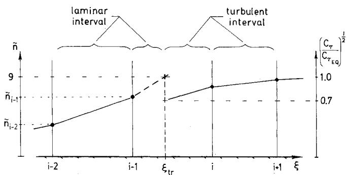  
Fig. 5 Transition interval treatment.

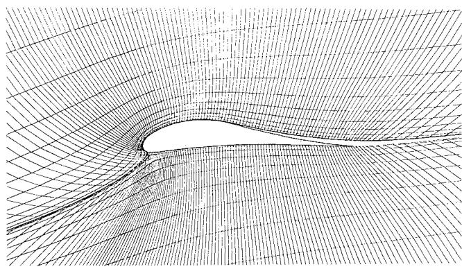  
Fig. 6 $132 \times 32$ grid near LNV109A airfoil.

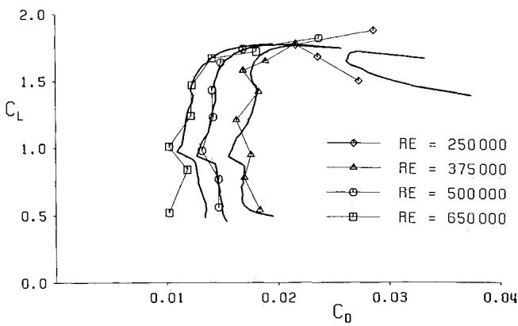  
Fig. 7 Calculated (heavy line) and experimental (symbols) drag polars for LNV109A airfoil.

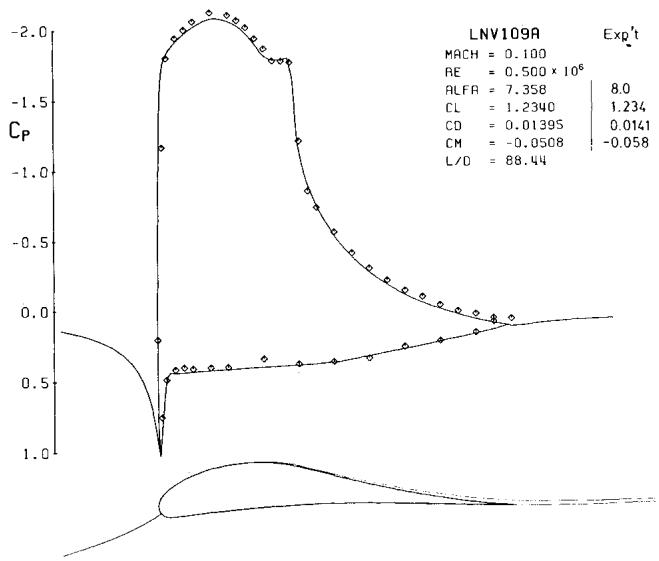  
Fig. 8 LNV109A calculated and experimental pressure distributions.

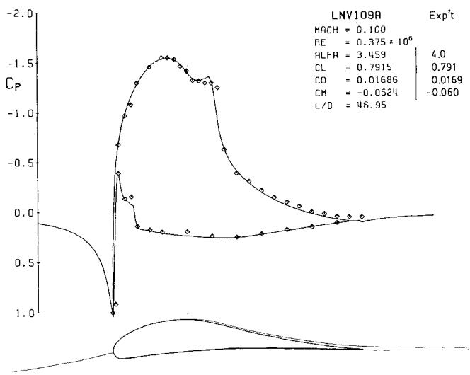  
Fig. 9 LNV109A calculated and experimental pressure distributions.

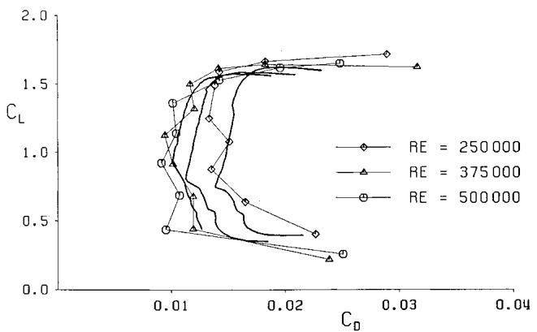  
Fig. 10 Calculated (heavy line) and experimental (symbols) drag polars for LA203A airfoil.

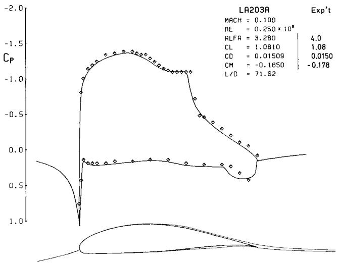  
Fig. 11 LA203A calculated and experimental pressure distributions.

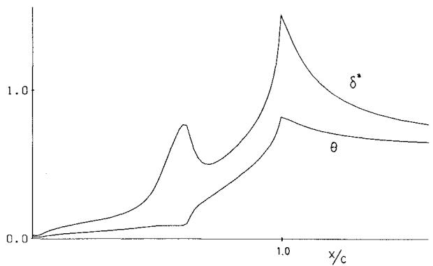  
Fig. 12 LA203A calculated suction surface $\delta^{*}$ and $\theta$ distributions.

unknown inviscid changes $\delta \rho$ , $\delta n$ , and the viscous changes $\delta \theta$ , $\delta \delta^{*}$ , $\delta C_{\tau}^{\frac{1}{2}}$ for one streamwise grid station. At laminar stations, $\delta \tilde{n}$ replaces $\delta C_{\tau}^{\frac{1}{2}}$ . At stations with no boundary layer or wake, only dummy viscous variables are present. The inviscid change $\delta n$ is the grid node movement perpendicular to the local streamline direction.

The Newton system (38) is solved every iteration by a direct Gaussian block-elimination method. For the $132 \times 32$ grid sizes used for the calculations presented in this paper, this solution method is faster than the best iterative methods available. Each Newton iteration requires approximately 4 min CPU on a microVAX II minicomputer. Of course, very

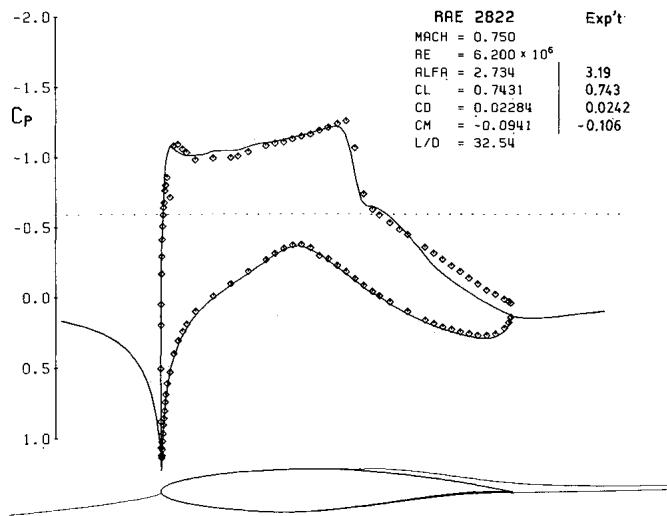  
Fig. 13 RAE 2822 calculated and experimental pressure distributions.

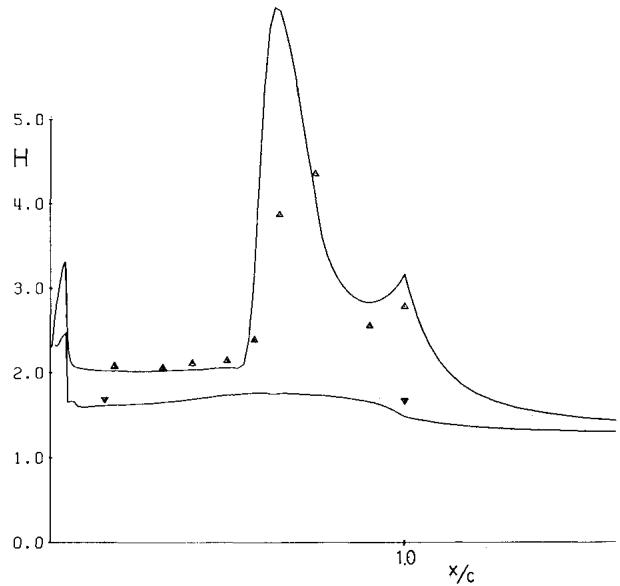  
Fig. 14 RAE 2822 calculated and measured $H$ distributions.

few Newton iterations are required to achieve convergence. In theory, the convergence is quadratic and, in practice, the number of iterations required ranges from only 3 for a subsonic, inviscid case, up to 15 for a transonic case with a strong shock and boundary-layer coupling.

# VI. Results

The results presented here are aimed at demonstrating the accuracy and speed of the ISES code for low Reynolds number and transonic airfoil flows. The polars were calculated by specifying a sequence of angles of attack in increments of 0.5 deg. Since a good initial guess was available for each point from the previous angle of attack, the Newton solver required only 2 or 3 iterations to converge each point. Clearly, the quadratic convergence property of the Newton method gives large CPU savings in such a parameter sweep.

# LNV109A Airfoil

This airfoil was designed by Liebeck to attain a specified maximum lift coefficient under the constraint of a maximum permissible pitching moment. The airfoil coordinates and experimental data were obtained from Liebeck and Camacho.[21] Figure 6 shows the $132 \times 32$ grid near the airfoil used for the calculations.

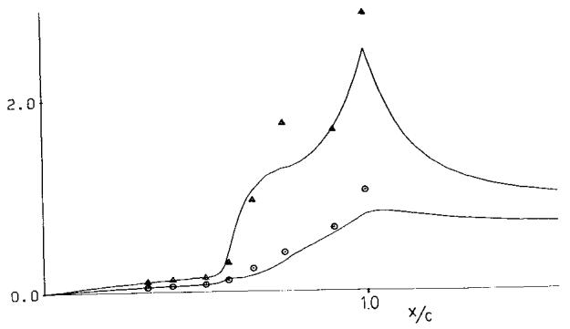  
Fig. 15 RAE 2822 calculated and measured suction surface $\delta^{*}$ and $\theta$ distributions.

Four polars were calculated for chord Reynolds numbers of 250,000, 375,000, 500,000, 650,000 and are shown in Fig. 7. The most important feature to point out is that the rapid performance degradation with decreasing Reynolds number is accurately predicted. The sharp increase in drag below a lift coefficient of about 0.9 in three of the polars is due to the pressure side transition point suddenly moving to the leading edge. This jump appears to be present in the experimental data as well. For the lowest Reynolds number (250,000), only the upper part of the polar is shown since massive separation due to the bubble bursting occurred for lift coefficients less than about 1.3, and the code failed to converge properly as a result. The same massive separation was observed in the experiment. Figures 8 and 9 show the calculated and experimental pressure distributions for two particular Reynolds numbers and angles of attack. The separation bubbles are clearly discernable in both the calculated and experimental pressure distributions.

# LA203A Airfoil

This is an aft-loaded airfoil designed by Liebeck to contrast with the front-loaded LNV109A. The airfoil coordinates and experimental data were again obtained from Liebeck and Camacho.[21] The lack of a pitching moment constraint allowed milder adverse pressure gradients to be imposed at the bubble. As a result, the LA203A airfoil does not experience bubble bursting at the lowest Reynolds number, as occurred with the LNV109A.

For the LA203A, three polars were calculated for chord Reynolds numbers of 250,000, 375,000, 500,000 and are shown in Fig. 10. Again, the rapid performance degradation with decreasing Reynolds number is predicted reasonably well, given the large amount of noise in the experimental data. Figure 11 shows the calculated and experimental pressure distributions for a Reynolds number of 250,000. The very large separation bubbles are clearly discernable in both the calculated and experimental pressure distributions. Figure 12 shows the calculated suction surface $\delta^{*}$ and $\theta$ distributions for this particular operating point of the LA203A. The jump in the momentum thickness $\theta$ at the bubble reattachment point is clearly discernable.

# RAE 2822 Airfoil

The last computational example shown is case 10 of the series of transonic tunnel experiments involving the RAE 2822 airfoil and documented in Cook et al.[22] Case 10 corresponds to a Mach number of 0.75 and a lift coefficient of 0.743 and involves limited shock-induced separation immediately behind the strong suction surface shock wave. The separation was reportedly visualized in the experiment using the oil-flow technique. A calculation of this case reproduces the separation fairly accurately. Figure 13 shows the calculated and experimental pressure distributions. Note that the drag coefficient is also accurately predicted. Figures 14

and 15 show the calculated and measured boundary-layer parameters. The agreement is quite good, given the substantial tunnel interference effects that might be expected for this case.

# VII. Conclusions

This paper has presented a viscous/inviscid analysis method suitable for transonic and low Reynolds number airfoils. A two-equation, integral, laminar/turbulent boundary-layer method based on dissipation closure has been summarized. An Orr-Sommerfeld-based transition prediction formulation is used and is incorporated into the boundary-layer analysis. The viscous formulation is fully coupled with the inviscid flow that is governed by a streamline-based Euler formulation. The applicability of the global Newton solution procedure to solving the entire coupled nonlinear system of equations has been shown.

The results show that the present analysis method can accurately predict airfoil performance at low Reynolds numbers due to the accurate representation of the separation bubble losses. Robustness in calculating a strongly interacting transonic case with shock-induced separation has also been demonstrated.

# Acknowledgments

This research was supported by Air Force Office of Scientific Research Contract F49620-78-C-0084, supervised by Dr. James D. Wilson.

# References

$^{1}$ Bauer, F., Garabedian, P., Korn, D., and Jameson, A., “Supercritical Wing Sections I, II, III,” Lecture Notes in Economics and Mathematical Systems, Springer-Verlag, New York, 1972, 1975, 1977.   
2Melnik, R.E., Chow, R. R., and Mead, H. R., “Theory of Viscous Transonic Flow Over Airfoils at High Reynolds Number,” AIAA Paper 77-680, June 1977.   
3Gleyzes, C., Cousteix, Jr., and Bonnet, J. L., “Theoretical and Experimental Study of Low Reynolds Number Transitional Separation Bubbles,” Presented at the Conference on Low Reynolds Number Airfoil Aerodynamics, University of Notre Dame, Notre Dame, IN, 1985.   
${}^{4}$ Vatsa, V. N. and Carter, J. E., "Analysis of Airfoil Leading Edge-Separation Bubbles," AIAA Journal, Vol. 22, Dec. 1984, pp. 1697-1704.   
5Giles, M. B., "Newton Solution of Steady Two-Dimensional Transonic Flow," Massachusetts Institute of Technology, Gas Turbine Laboratory Rept. 186, Oct. 1985.   
$^{6}$ Drela, M., “Two-Dimensional Transonic Aerodynamic Design and Analysis Using the Euler Equations,” Massachusetts Institute of Technology, Gas Turbine Laboratory Rept. 187, Feb. 1986.   
7Giles, M. B., Drela, M., and Thompson, W. T., “Newton Solution of Direct and Inverse Transonic Euler Equations,” AIAA Paper 85-1530, July 1985.   
$^{8}$ Giles, M. B. and Drela, M., “A Two-Dimensional Transonic Aerodynamic Design Method,” AIAA Journal, Vol. 25, Sept. 1987, pp. 1199-12060.   
$^{9}$ Drela, M., Giles, M. B., and Thompkins, W. T., "Newton Solution of Coupled Euler and Boundary Layer Equations," Presented at the Third Symposium on Numerical and Physical Aspects of Aerodynamic Flows, Long Beach, CA, Jan. 1985.   
10Melnik, R. E. and Brook, J. W., "Computation of Viscid/Inviscid Interaction on Airfoils with Separated Flow," Presented at the Third Symposium on Numerical and Physical Aspects of Aerodynamic Flows, Long Beach, CA, Jan. 1985.   
11Le Balleur, J. C., "Strong Matching Method for Computing Transonic Viscous Flows Including Wakes and Separations on Lifting Airfoils," La Recherche Aérospatiale, No. 1981-83, English Ed., 1981-83, pp. 21-45.   
12 Whitfield, D. L., “Analytical Description of the Complete Turbulent Boundary Layer Velocity Profile,” AIAA Paper 78-1158, 1978.   
13Cebeci, T. and Bradshaw, P., Momentum Transfer in Boundary Layers, McGraw-Hill, New York, 1977.

14 Whitfield, D. L., “Integral Solution of Compressible Turbulent Boundary Layers Using Improved Velocity Profiles,” Arnold Air Force Station, AEDC-TR-78-42, 1978.   
15Swafford, T. W., "Analytical Approximation of Two-Dimensional Separated Turbulent Boundary-Layer Velocity Profiles," AIAA Journal, Vol. 21, June 1983, pp. 923-926.   
16Green, J. E., Weeks, D. J. and Brooman, J.W.F., "Prediction of Turbulent Boundary Layers and Wakes in Compressible Flow by a Lag-Entrainment Method," ARC R&M Rept. No. 3791, HMSO, London, England, 1977.   
17Bradshaw, P. and Ferriss, D. H., "Calculation of BoundaryLayer Development Using the Turbulent Energy Equation: Compressible Flow on Adiabatic Walls," Journal of Fluid Mechanics, Vol. 46, Pt. 1, 1970, pp. 83-110.   
18Clauser, F. H., "Turbulent Boundary Layers in Adverse Pressure Gradients," Journal of Aeronautical Sciences, Vol. 21,

Feb. 1954, pp. 91-108.   
Smith, A.M.O. and Gamberoni, N., "Transition, Pressure Gradient, and Stability Theory," Douglas Aircraft Co., Rept. ES 26388, 1956.   
20Ingen, J. L. van, “A Suggested Semi-Empirical Method for the Calculation of the Boundary Layer Transition Region,” Delft University of Technology, Dept. of Aerospace Engineering, Rept. VTH-74, 1956.   
21 Liebeck, R. H. and Camacho, P. P., "Airfoil Design at Low Reynolds Number with Constrained Pitching Moment," Presented at the Conference on Low Reynolds Number Airfoil Aerodynamics, University of Notre Dame, Notre Dame, IN, UNDAS-CP-77B123, June 1985.   
22Cook, P. H., McDonald, M. A., and Firmin, M.C.P., AGARD Working Group 7, "Test Cases for Inviscid Flow Field Methods," AGARD Rept. AR-211, 1985.

From the AIAA Progress in Astronautics and Aeronautics Series...

# LIQUID-METAL FLOWS AND MAGNETOHYDRODYNAMICS-v.84

Edited by H. Branover, Ben-Gurion University of the Negev

P.S. Lykoudis, Purdue University

A. Yakhot, Ben-Gurion University of the Negev

Liquid-metal flows influenced by external magnetic fields manifest some very unusual phenomena, highly interesting scientifically to those usually concerned with conventional fluid mechanics. As examples, such magnetohydrodynamic flows may exhibit M-shaped velocity profiles in uniform straight ducts, strongly anisotropic and almost two-dimensional turbulence, many-fold amplified or many-fold reduced wall friction, depending on the direction of the magnetic field, and unusual heat-transfer properties, among other peculiarities. These phenomena must be considered by the fluid mechanistic concerned with the application of liquid-metal flows in particular systems. Among such applications are the generation of electric power in MHD systems, the electromagnetic control of liquid-metal cooling systems, and the control of liquid metals during the production of the metal castings. The unfortunate dearth of textbook literature in this rapidly developing field of fluid dynamics and its applications makes this collection of original papers, drawn from a worldwide community of scientists and engineers, especially useful.

Published in 1983, 454 pp., 6×9, illus., $25.00 Mem., $55.00 List

TO ORDER WRITE: Publications Dept. AIAA, 370 L'Enfant Promenade, S.W., Washington, D.C. 20024-2518